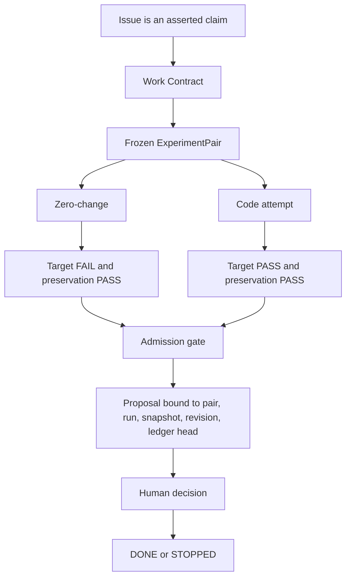

# Mosaic

<p align="center">
  
</p>

<p align="center">
  <strong>A durable execution and admission harness for software change.</strong><br>
  Mosaic preserves the work contract, freezes verification inputs, and admits
  only evidence-bound interventions.
</p>

[](LICENSE)
[](pyproject.toml)

Mosaic is not a coding agent. It controls external agents through a durable
work contract and an admission gate. It does not assume every issue needs a
patch, or that a passing test proves the issue is resolved. `NO_CHANGE` is a
valid final answer.

The mark is a tile that has not been set. Missing sockets are uncertainty. The
gold grout is a verification thread, not a score.

## Status

Version 0.3 contains two layers:

- **Admission Plane (0.2):** a frozen `ExperimentPair` proves target
  `FAIL → PASS` while preservation checks pass for zero-change and code.
- **Execution Plane (0.3):** an event-sourced `WorkContract`, `WorkState`, and
  `ResumePacket` survive process or conversation restarts.

Real process isolation is claimed only on macOS after a successful
`/usr/bin/sandbox-exec` capability probe. Portable semantic tests use a fake
runner on Linux and macOS; that does not constitute an isolation claim. There
is no LLM Builder, multi-agent scheduler, or network ledger anchor.

See [docs/architecture.md](docs/architecture.md) for the control loop,
[docs/using.md](docs/using.md) for the full command sequence, and
[CHANGELOG.md](CHANGELOG.md) for release changes and compatibility notes.

## Install

Python 3.11 or newer. No third-party runtime dependencies. Git is optional.

```bash
python3 -m venv .venv
.venv/bin/pip install -e .
mosaic --version
```

From a source checkout:

```bash
PYTHONPATH=src python3 -m mosaic_harness --help
```

## How it decides



A `CODE_CHANGE` is admitted only when all of these hold:

1. Zero-change and code use the same repository revision and frozen contract.
2. Every target is `FAIL` on zero-change and `PASS` on code.
3. Every preservation check is `PASS` on both candidates.
4. Every explicitly required hidden, mutation, or property adapter passes;
   `ABSENT` and `ERROR` fail closed.
5. The code attempt is unchanged after freezing and remains on the eligible
   code-only Pareto frontier.
6. The code hypothesis is supported, required rivals are refuted, and the
   observation plan has a signal and rollback trigger.
7. The human decision exactly matches the latest non-stale proposal.

There is no `--override` and no weighted score. A failed gate cannot be
converted into approval.

## Quick start

Keep three trees separate: this tool, the application `--repo`, and a
disposable `--root` for the ledger. Do not point `--repo` at Mosaic itself.

```bash
mosaic --root /tmp/case init
mosaic --root /tmp/case investigate CASE-1 \
  --issue path/to/issue.md \
  --repo path/to/application \
  --signal "The test that encodes the defect passes." \
  --rollback-trigger "Dispose the candidate; do not merge."

mosaic --root /tmp/case work create CASE-1 \
  --contract work-contract.json --actor you@example.com
mosaic --root /tmp/case work next CASE-1
mosaic --root /tmp/case work task start CASE-1 INVESTIGATION_TASK \
  --actor you@example.com
mosaic --root /tmp/case work task complete CASE-1 INVESTIGATION_TASK \
  --evidence-ref EVIDENCE_ID --actor you@example.com
mosaic --root /tmp/case candidate prepare-pair CASE-1 \
  --repo path/to/application \
  --verification-contract verification-contract.json
mosaic --root /tmp/case work attach-pair CASE-1 PAIR_ID \
  --code-run CODE_RUN --actor you@example.com
mosaic --root /tmp/case work next CASE-1
mosaic --root /tmp/case work task start CASE-1 IMPLEMENTATION_TASK \
  --actor you@example.com
mosaic --root /tmp/case candidate build CASE-1 CODE_RUN --script fix.json
mosaic --root /tmp/case work task complete CASE-1 IMPLEMENTATION_TASK \
  --evidence-ref run:CODE_RUN --actor you@example.com
mosaic --root /tmp/case work implementation-complete CASE-1 --actor you@example.com
mosaic --root /tmp/case candidate verify-pair CASE-1 PAIR_ID --code-run CODE_RUN
mosaic --root /tmp/case propose CASE-1
mosaic --root /tmp/case decide CASE-1 CODE_CHANGE \
  --proposal PROPOSAL_ID \
  --actor you@example.com \
  --rationale "The code candidate survives the floor that encodes the defect."
mosaic --root /tmp/case work finish CASE-1 --actor you@example.com
mosaic --root /tmp/case verify CASE-1
```

A sibling experiment target, **Spike**, lives next to this repository when you
clone both. Its public floor is a single failing test about completed tickets
staying on the active rail. Reusable 0.3 smoke contracts and the confined fix
script live in [`examples/spike/`](examples/spike/).

## Commands

| Area | Commands |
|------|----------|
| Case | `init` `investigate` `evidence add` `challenge` `propose` `show` `decide` `verify` `rebuild` `observation-plan` |
| Candidate | `candidate prepare-pair` `exec` `build` `verify-pair` `retry-code` `compare` `dispose` `interrupt` `show` `show-pair` |
| Work | `work create` `status` `next` `attach-pair` `task start|block|unblock|complete` `implementation-complete` `replan` `resume` `finish` |
| After | `observe` `memory invalidate` `tournament run` `ledger export` `ledger compare` |
| Constitution | `amend` (Maintenance Mode only) |

## Development

```bash
PYTHONPATH=src python3 -m unittest discover -s tests -v
```

Please read [CONTRIBUTING.md](CONTRIBUTING.md) and [SECURITY.md](SECURITY.md)
before sending a change. [CODE_OF_CONDUCT.md](CODE_OF_CONDUCT.md) applies.

## License

[MIT](LICENSE). Brand stills are in [docs/brand/](docs/brand/).
