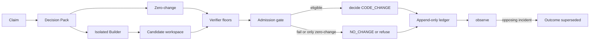
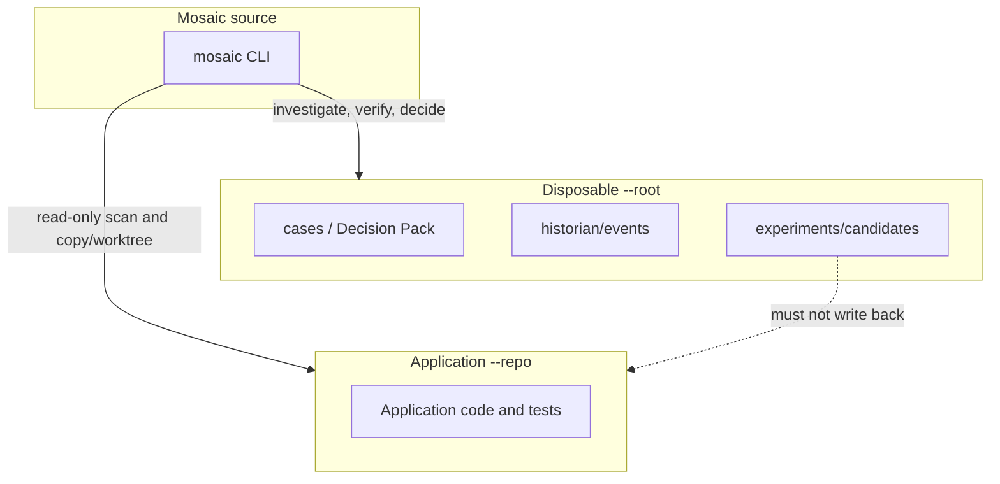
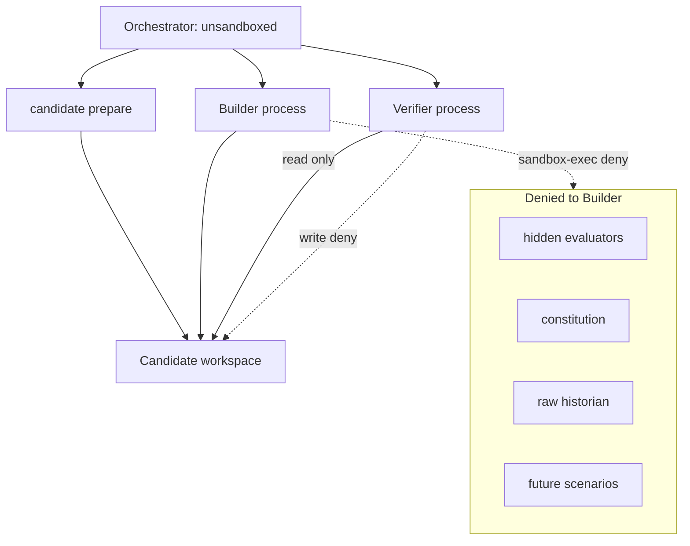
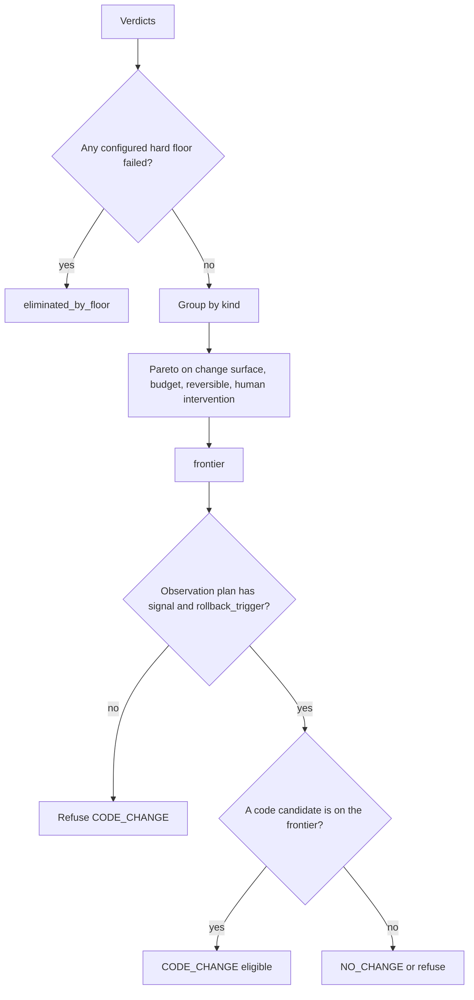
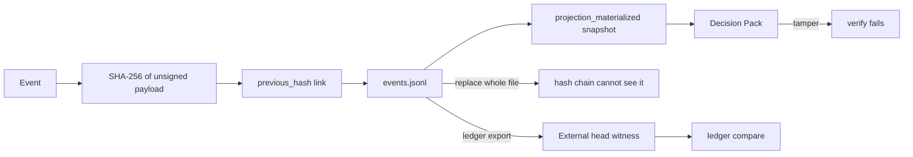

# Architecture

Mosaic is a local Python CLI. It keeps beliefs in a Decision Pack projection
and truth in an append-only hash-chained ledger.

## Control loop

## Three trees

| Tree | Role |
|------|------|
| Mosaic source | The tool |
| Application `--repo` | The software under investigation |
| Disposable `--root` | Cases, ledger, candidates |

Never point `--repo` at the Mosaic source tree. Its `tests/` become the public
floor.

## Roles and isolation

- **Builder** writes only inside an isolated candidate. It cannot read hidden
  evaluators, constitution, the raw historian, or future scenarios.
- **Verifier** runs floors against a frozen candidate. It cannot edit that
  candidate while evaluation is active.
- **Historian** appends events. It does not rewrite them.
- **Observer** records post-change evidence. It cannot `decide`.
- **Amender** exists only in Maintenance Mode, in a separate worktree.

`permissions.yaml` names these roles. Enforcement, where it exists, is the
executor plus `sandbox-exec` on macOS.

## Admission

1. Apply hard floors. Unconfigured hidden/property suites are not passes.
2. Drop floor failures.
3. Compare remaining same-kind candidates by Pareto dominance (smaller change
   surface, smaller budget, reversible, no human intervention).
4. `CODE_CHANGE` is eligible only if a code candidate remains on the frontier
   and the observation plan names `signal` and `rollback_trigger`.

There is no weighted score.

## Modules

| Module | Job |
|--------|-----|
| `workflow` | Investigate, evidence, propose, decide, rebuild |
| `candidate` | Prepare, build, verify, compare candidates |
| `isolation` / `executor` / `workspace` | Sandbox, run, materialize |
| `builder` | Scripted writes confined to the candidate |
| `verifiers` | Public, hidden, mutation, property, differential |
| `admission` | Floor-then-Pareto gate |
| `tournament` | Equal-budget hidden scenarios |
| `observers` / `memory` / `amendment` / `anchor` | After-change and self-change |

## Trust

The ledger detects tampering. It does not stop someone with filesystem write
access from replacing the file. `mosaic ledger export` writes a head witness
for comparison outside the tree. That is not a timestamp authority.
