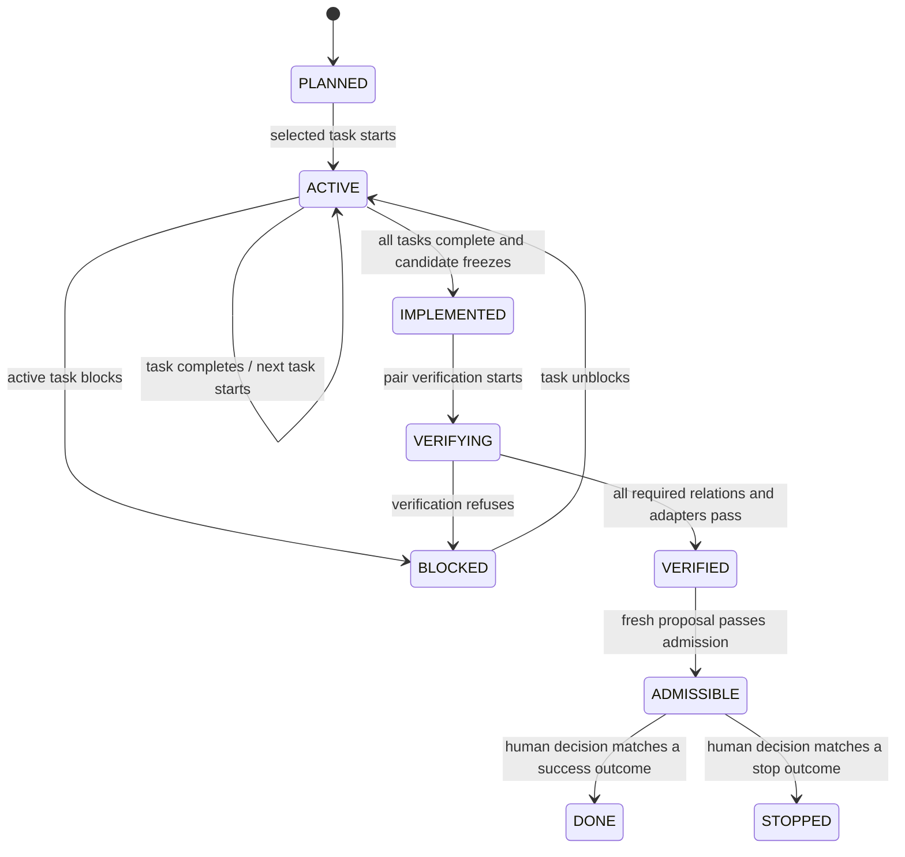
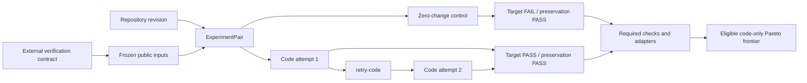
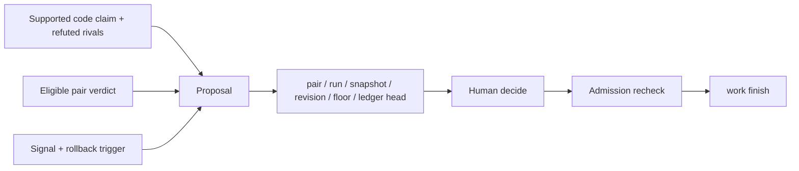
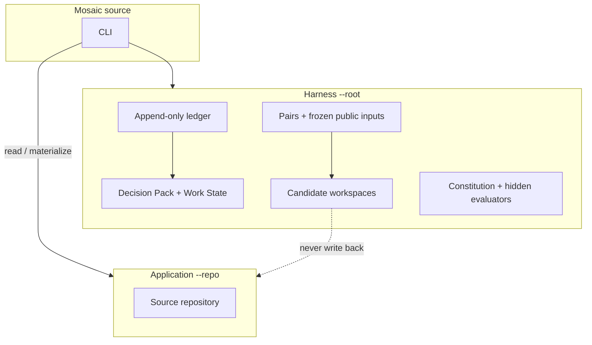

# Architecture

Mosaic is a generic local CLI that controls external agents. It has two
coupled planes over one append-only hash-chained ledger:

- the **Admission Plane** freezes verification inputs and refuses unproven or
  stale changes;
- the **Execution Plane** reconstructs a single worker's goal, task state, and
  allowed next action after a process or conversation restart.

Decision Packs and Work State files are projections. The ledger is the
authoritative record.

## State machine

An external agent can advance work only through `IMPLEMENTED`. The Verifier,
proposal gate, human decision, and `work finish` own the remaining transitions.
Direct shortcuts such as `ACTIVE → VERIFIED` or `RUNNING → DONE` have no API.

## ExperimentPair

The pair binds one base revision, source snapshot, contract digest, zero-change
run, and one or more code attempts. Public check entrypoints and inputs are
copied under the pair's floor before any Builder runs. Candidate-local `tests/`
therefore cannot redefine admission.

Check results use exactly four states:

| Status | Meaning |
|---|---|
| `PASS` | The check returned the contract's success result. |
| `FAIL` | The check ran normally and rejected the candidate. |
| `ABSENT` | A required input or evaluator does not exist. |
| `ERROR` | Timeout, isolation denial, runner failure, or invalid result. |

Targets require `zero=FAIL, code=PASS`. Preservation checks require
`zero=PASS, code=PASS`. `ABSENT` and `ERROR` always refuse admission.

Mutation runs every deterministically selected mutant. Syntax-invalid mutants
and runner errors are `ERROR`; a normal test failure kills a mutant; exit zero
means the mutant survived. The mutation adapter passes only when at least one
mutant exists and every mutant is killed.

## Proposal and decision binding

Any evidence, replan, candidate, revision, floor, or ledger change makes the
proposal stale. Admission recomputes the candidate snapshot, repository
revision, and frozen-floor integrity. There is no override path.

`CONFIGURATION_CHANGE`, `DOCUMENTATION_CHANGE`, and `OPERATIONAL_ACTION` remain
inadmissible until typed verification adapters define their target and
preservation evidence.

## Work Contract and ResumePacket

The Work Contract contains immutable goal fields plus a versioned task DAG.
Only one task can be running or blocked. `work next` selects the first pending
task in contract order whose dependencies are complete, so a restart produces
the same answer.

Replan may add tasks, replace unfinished tasks, and adjust dependencies or
read/write sets. It cannot change the objective, constraints, non-goals,
acceptance criteria, completion policy, or completed task definitions. Replan
after implementation marks prior verdicts and proposals stale and requires a
new code attempt derived through `retry-code`.

The ResumePacket is a projection, not memory or hidden reasoning. It includes:

- contract ID, revision, digest, objective, hard constraints, and non-goals;
- ledger head and repository revision;
- current and next task, blockers, completed tasks, and evidence references;
- active pair, code run, candidate snapshot, and stale artifacts;
- acceptance-criterion state and allowed next commands;
- invalidation values for ledger head, contract revision, and snapshot.

Hidden evaluator commands, paths, output, and chain-of-thought are excluded.

## Trees and authority boundaries

- The Builder writes only its mutable candidate and cannot read protected
  harness paths or pair internals.
- The Verifier reads a frozen candidate and writes full output only to its
  verifier artifact area. General verdicts contain hashes and bounded display
  data; hidden output remains verifier-only.
- The Historian appends events and never rewrites them.
- The Observer records evidence but cannot decide.
- The Amender operates only in Maintenance Mode in a separate worktree.

`permissions.yaml` describes roles but is not itself a security boundary.
Actual process isolation is claimed only when the macOS `sandbox-exec` probe
succeeds. Portable fake-runner tests establish verdict and state semantics, not
OS isolation.

## Version compatibility

Decision Packs, run manifests, and verdicts use schema `2.0.0`. Decision Pack
`1.0.0` cases are read-only: `show`, integrity `verify`, `candidate show`, and
ledger export/compare remain available. Mosaic performs no automatic migration
and never rewrites a legacy ledger.

## Modules

| Module | Responsibility |
|---|---|
| `verification_contract` | Validate and freeze public/hidden verification definitions. |
| `pair` | Prepare pairs, freeze attempts, and derive retries. |
| `pair_verifier` | Run pair relations, required adapters, and code-only Pareto comparison. |
| `work` | Validate contracts, reduce ledger events, emit ResumePackets, and finish work. |
| `workflow` | Investigate, record evidence, propose, decide, verify, and rebuild. |
| `candidate` / `builder` | Execute confined external Builder operations. |
| `isolation` / `executor` / `workspace` | Probe isolation, run commands, materialize, and snapshot. |
| `historian` / `storage` | Preserve the event chain and rebuildable projections. |

The ledger detects in-place tampering but cannot prevent a user with filesystem
write access from replacing the whole ledger. `ledger export` provides an
external head witness, not a timestamp authority or notary.
